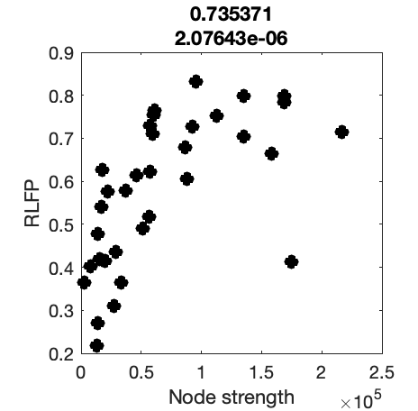
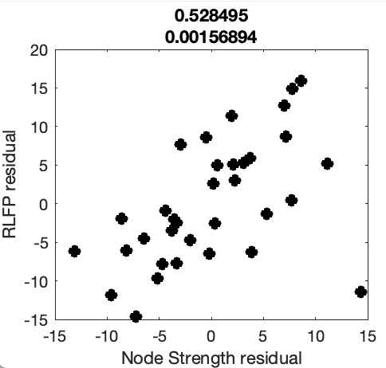
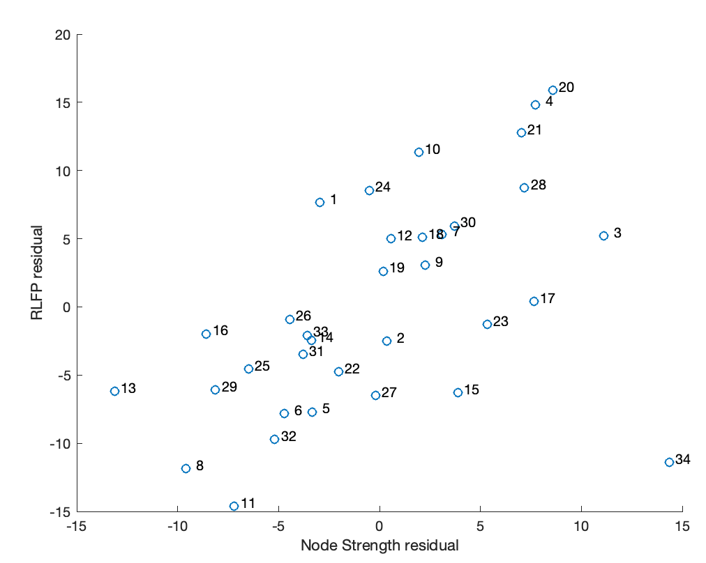
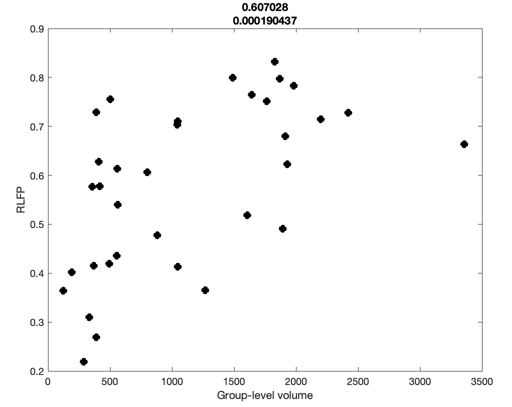
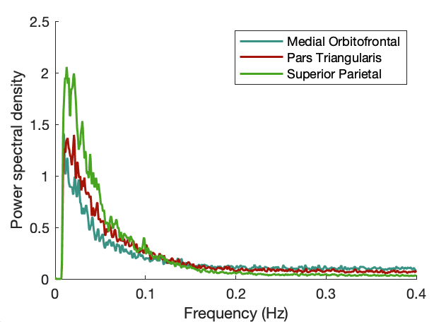
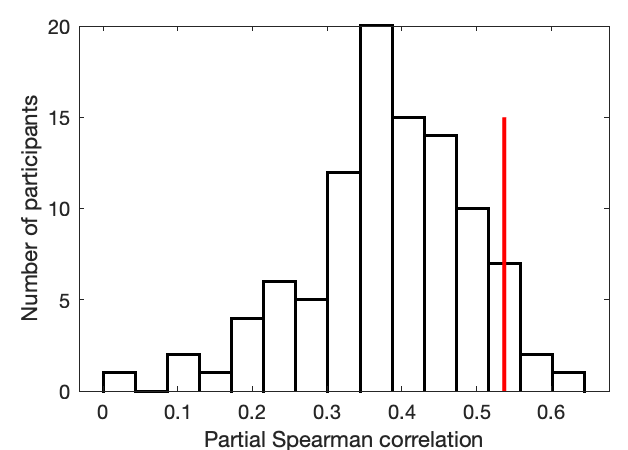
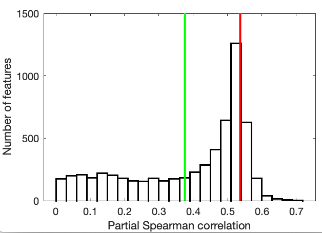
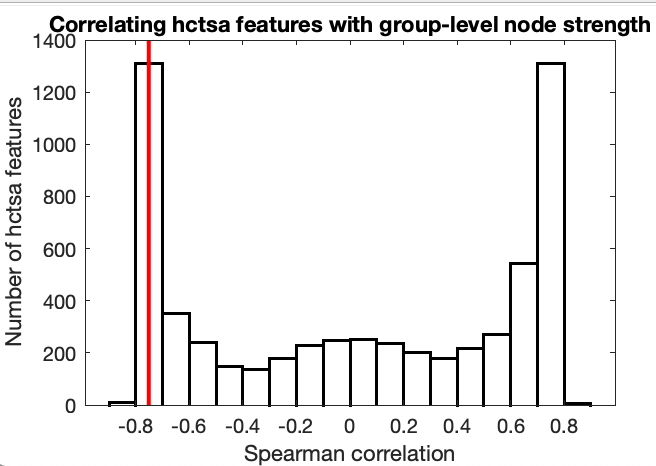

# Timescales of spontaneous fMRI fluctuations relate to structural connectivity in the brain

This repository contains code to reproduce the key figures from Fallon et al.: 'Timescales of spontaneous fMRI fluctuations relate to structural connectivity in the brain'.
[_bioRxiv_ preprint is here](https://doi.org/10.1101/655050).

#### Dependencies

Some code (for computing timescales) uses `CO_AutoCorrShape` and dependent functions in [_hctsa_](https://github.com/benfulcher/hctsa) ([v1.01](https://github.com/benfulcher/hctsa/releases/tag/v1.01) used for published results).

## Data

Data are available from [zenodo](https://zenodo.org/deposit/3909008).

* Subject info: `Data/subs100.mat`.
  Contains information about all subjects analyzed.
* Region volume: `Data/volume.mat`.
  Contains volume info for all ROIs in aparc/DK parcellation.
* Regional time series: `Data/rsfMRI`.
  Contains a `cfg.mat` file for all subjects (DK parcellation).
* Results of _hctsa_ analysis: `Data/hctsa_stats.mat`.
* Surface for surface plotting: `fsaverage_surface_data.mat`.

## Analysis Code

Add paths to all subdirectories by running `startup`.

### Plots of data for the schematic

Produce data for schematic figure (__Fig. 1__):
```matlab
dataPlotsForSchematic()
```

(Also outputs some surface-space plots used in __Fig. 2D__)

### Relative low-frequency power as a function of node strength (+ partial correction):
Produces __Fig. 2A__:

```matlab
params = GiveMeDefaultParams();
PlotNSScatter(params,'RLFP')
```

This outputs several figures and correlation statistics to the command-line:

| Description | Output |
| ------------- |:-------------:|
| Node strength scatter (correlation and _p_-value in title) |  |
| __Fig. 2A__: Residuals from region-volume variation (correlation and _p_-value in title) |  |
| Labeling of data points by region ID |  |
| Volume scatter |  |

These results can be re-run for `'timescale'` or `'fALFF'` instead of `'RLFP'`.

You can also run with different parcellations by modifying the corresponding element of the `params` structure.
For example, to produce Fig. 2C: `params.data.whatParcellation = 'cust200'` (requires additional data files for `'cust200'`).

### Plot power spectral density curves for selected regions
Produces __Fig. 2B__:

```matlab
PSD_plot()
```



### Inter-individual differences in correlations

Produces __Fig. 3__:
```matlab
InterIndividual()
```


### Comparison of selected feature to others from _hctsa_

```matlab
hctsaCorr()
```

__Fig 4__:



Also the raw distribution (without absolute value or taking residuals from volume):


